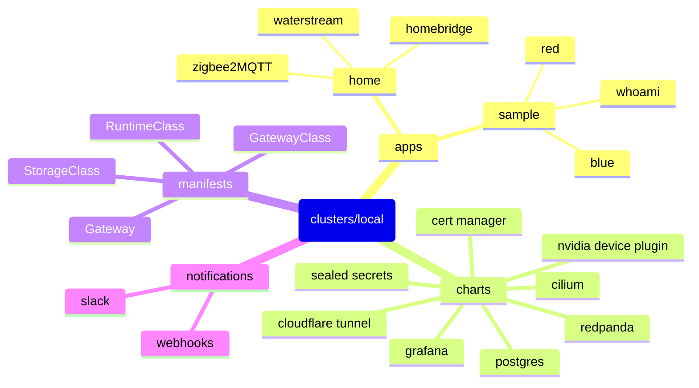

# Turing Pi 2 Kubernetes Cluster

Flux driven bare metal kubernetes cluster living on the edge.


## Getting Started

### Turing Pi

A compact AI & edge computing cluster.



#### Build

- [Densium APU](https://densium.net/products/densium-apu?Frontpanel=Dark+Walnut&Exterior=Black) 4L
- [Noctua NF-A14 ULN](https://noctua.at/en/products/fan/nf-a14-uln) 140mm
- [Pico PSU](https://turingpi.com/product/pico-psu/) 160w
- 3x [Turing RK1](https://turingpi.com/product/turing-rk1) 8 cores /  32 GB / 6 TOPS
- 1x [Nvidia Jetson Orin NX](https://www.nvidia.com/en-us/autonomous-machines/embedded-systems/jetson-orin/#tech-specs) 8 cores /  16 GB / 100 TOPS
- 4x [Samsung 970 EVO Plus NVMe M.2 SSD](https://www.samsung.com/us/computing/memory-storage/solid-state-drives/ssd-970-evo-plus-nvme-m-2-250gb-mz-v7s250b-am/) 250GB

32 cores / 112 GB / 118 TOPS

1TB storage

<https://turingpi.com/>

### Kubernetes (via k0s)

An open-source system for automating deployment, scaling, and management of containerized applications.

<https://k0sproject.io/>

### Flux

Used to **pull** repository changes into kubernetes clusters.

<https://fluxcd.io/>

### Cilium

Used for providing, securing, and observing network connectivity between workloads, powered by eBPF.

<https://cilium.io/>

### Brew

The Missing Package Manager for macOS (or Linux).

<https://brew.sh>

This repo includes a collection of dependencies to install:

```sh
brew bundle
```

## Usage

### Bootstrap

When spinning up the cluster for the first time, there are 3 primary steps.

1. Install `k0s`

    <https://docs.k0sproject.io/v1.28.2+k0s.0/k0sctl-install/>

    ```sh
    k0sctl apply --config ./clusters/overlays/local/k0s.yaml
    k0sctl kubeconfig --config ./clusters/overlays/local/k0s.yaml
    # add the output of this to ~/.kube/config
    ```

2. Bootstrap `flux`

    <https://fluxcd.io/flux/installation/bootstrap/github/>

    ```sh
    flux bootstrap github \
      --components-extra=image-reflector-controller,image-automation-controller \
      --owner=dudo \
      --repository=turing-pi \
      --private=false \
      --personal=true \
      --path=clusters/overlays/local
    ```

3. Install `cilium`

    <https://docs.cilium.io/en/stable/gettingstarted/k8s-install-default/>

    - [System Requirements](https://docs.cilium.io/en/stable/operations/system_requirements/#admin-system-reqs)
    - [Rebuilding the Linux Kernel](https://gist.github.com/dudo/7d853fd54f2d3db6e5e44b8b59ae12d5)

    ```sh
    cilium install --version 1.14.2
    cilium status --wait
    ```

### kubectl

<https://kubernetes.io/docs/reference/kubectl/cheatsheet/>

```sh
kubectl get GitRepository -n flux-system
kubectl get Kustomization -n flux-system
kubectl get HelmRelease -n blue
kubectl logs -n flux-system deploy/image-automation-controller

kubectl run curl --image=curlimages/curl --restart=Never --rm -it -- sh
kubectl run busybox --image=busybox --restart=Never --rm -it -- sh
```

### flux

<https://fluxcd.io/flux/cmd/>

```sh
flux get all -A

flux suspend image update my-service
flux resume image update my-service

flux reconcile source git flux-system
flux reconcile kustomization flux-system
flux reconcile kustomization charts
```

### kubeseal

<https://github.com/bitnami-labs/sealed-secrets>

```sh
encoded_string=$(echo -n "This is a string" | base64)
encoded_string=$(base64 <<EOF
  This is a
  multi-line string
  that I want to encode.
EOF
)

kubeseal --format=yaml <<EOF
apiVersion: v1
kind: Secret
metadata:
  name: mysecret
  namespace: whatever
data:
  my.file: ${encoded_string}
EOF
```

### Reset

Tearing down the cluster is a 1 step process.

1. Reset the cluster

   <https://docs.k0sproject.io/v1.28.2+k0s.0/reset/>

   ```sh
   k0sctl reset --config ./clusters/overlays/local/k0s.yaml
   ```

## Pertinent Sections

- [Apps](./apps)
- [Charts](./charts)
- [Clusters](./clusters)
- [Manifests](./manifests)
- [Notifications](./notifications)
