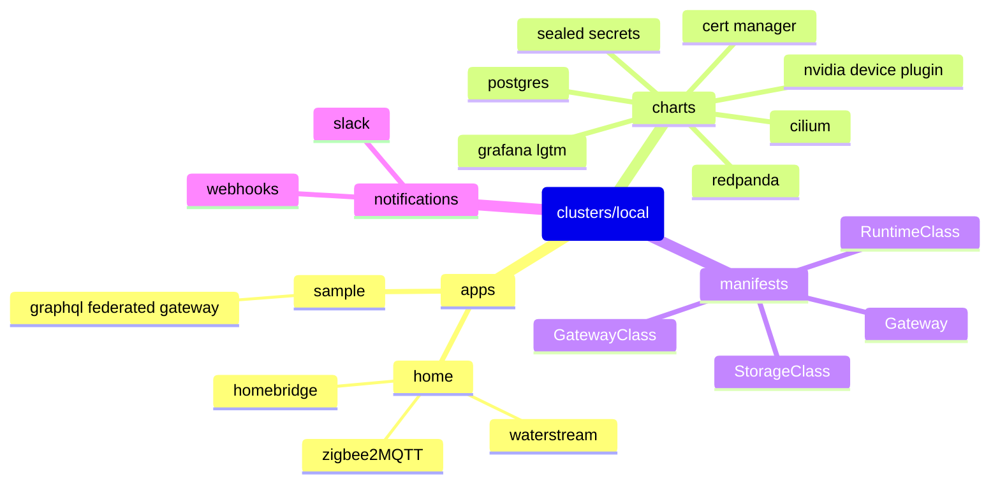

# Turing Pi 2 Kubernetes Cluster

Flux driven bare metal kubernetes cluster living on the edge.


## Getting Started

### Turing Pi

A compact AI & edge computing cluster.



#### Build

- [Densium APU](https://densium.net/products/densium-apu?Frontpanel=Dark+Walnut&Exterior=Black) 4L
- [Noctua NF-A14 ULN](https://noctua.at/en/products/fan/nf-a14-uln) 140mm
- [Pico PSU](https://turingpi.com/product/pico-psu/) 160w
- 3x [Turing RK1](https://turingpi.com/product/turing-rk1) 8 cores /  32 GB / 6 TOPS
- 1x [Nvidia Jetson Orin NX](https://www.nvidia.com/en-us/autonomous-machines/embedded-systems/jetson-orin/#tech-specs) 8 cores /  16 GB / 100 TOPS
- 4x [Samsung 970 EVO Plus NVMe M.2 SSD](https://www.samsung.com/us/computing/memory-storage/solid-state-drives/ssd-970-evo-plus-nvme-m-2-250gb-mz-v7s250b-am/) 250GB

32 cores / 112 GB / 118 TOPS

1TB storage

<https://turingpi.com/>

### Kubernetes (via k0s)

An open-source system for automating deployment, scaling, and management of containerized applications.

<https://k0sproject.io/>

### Flux

Used to **pull** repository changes into kubernetes clusters.

<https://fluxcd.io>

### Brew

The Missing Package Manager for macOS (or Linux).

<https://brew.sh>

This repo includes a collection of dependencies to install:

```sh
brew bundle
```

## Usage

### Flux CLI

#### Bootstrap

When spinning up an env for the first time (you should never really need to do this, unless locally):

```sh
flux bootstrap github \
  --components-extra=image-reflector-controller,image-automation-controller \
  --owner=dudo \
  --repository=turing-pi \
  --private=false \
  --personal=true \
  --path=clusters/overlays/local
```

#### Useful Commands

```sh
flux suspend image update my-service
flux resume image update my-service
flux reconcile source git flux-system
flux reconcile kustomization flux-system
flux reconcile kustomization charts

kubectl logs -n flux-system deploy/image-automation-controller

flux get all -A
kubectl get GitRepository -n flux-system
kubectl get Kustomization -n flux-system
kubectl get HelmRelease -n blue
```

### Sealed Secrets

```sh
base64 <<EOF
This is a
multi-line string
that I want to encode.
EOF

kubeseal --format=yaml <<EOF
apiVersion: v1
kind: Secret
metadata:
  name: mysecret
  namespace: whatever
data:
  my.file: Y2xpZW50c0xpbWl0OklOVD0=
```

## Pertinent Sections

- [Apps](./apps)
- [Charts](./charts)
- [Clusters](./clusters)
- [Manifests](./manifests)
- [Notifications](./notifications)
